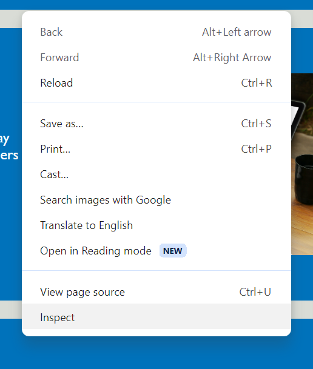
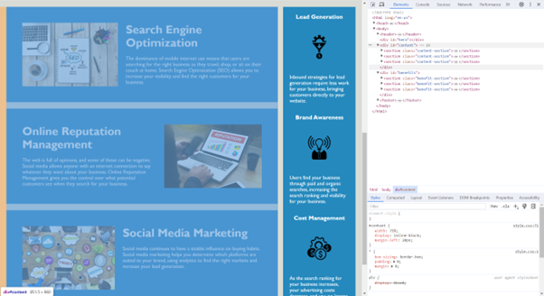

# Horiseon Refactor

## Description
I was motivated to restructure and modernise this code in order to improve the website's accessibility whilst building upon my understanding of semantic HTML elements and CSS.
This newer, updated version of the webpage solves the issue of the old code being messy by improving the structure of the webpage and merging many unnecesary classes into one. It also includes support for users using a screen reader.
Whilst attempting this challenge. I built upon my knowledge of using universal selectors, element selectors and class/ID selectors. My main takeaway from this challenge was understanding the difference between a div element and a section element.

## Installation
N/A

## Usage
The updated website can be found here: https://lwse13.github.io/Horiseon-Refactor/

The webpage's index.html and style.css can be opened in VS code. Alternatively, you can use any modern browser's "inspect" function to look into the code. To do this right click on a webpage and click "inspect" to open the console.

   

## Credits
N/A

## License#
N/A
